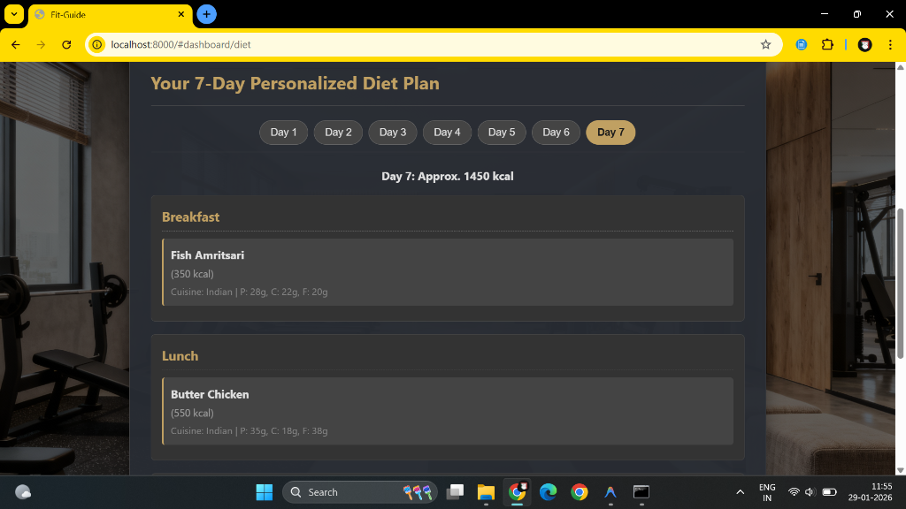
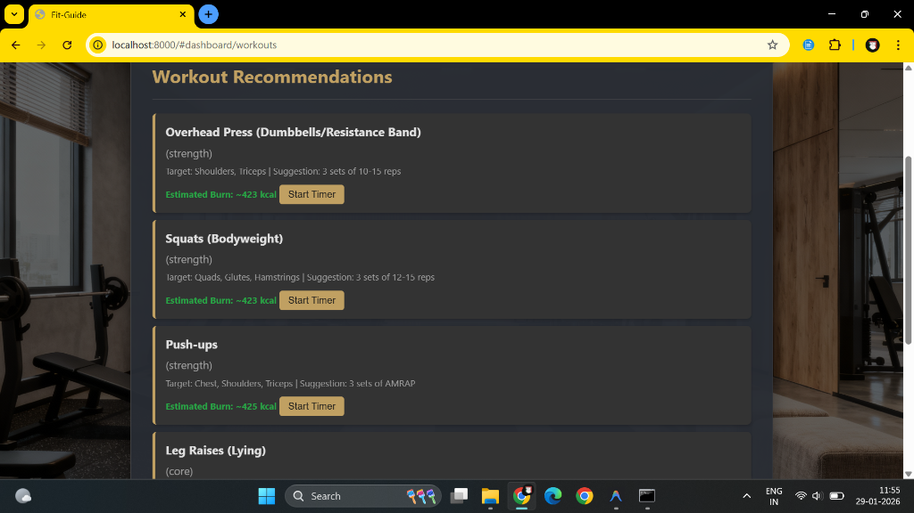
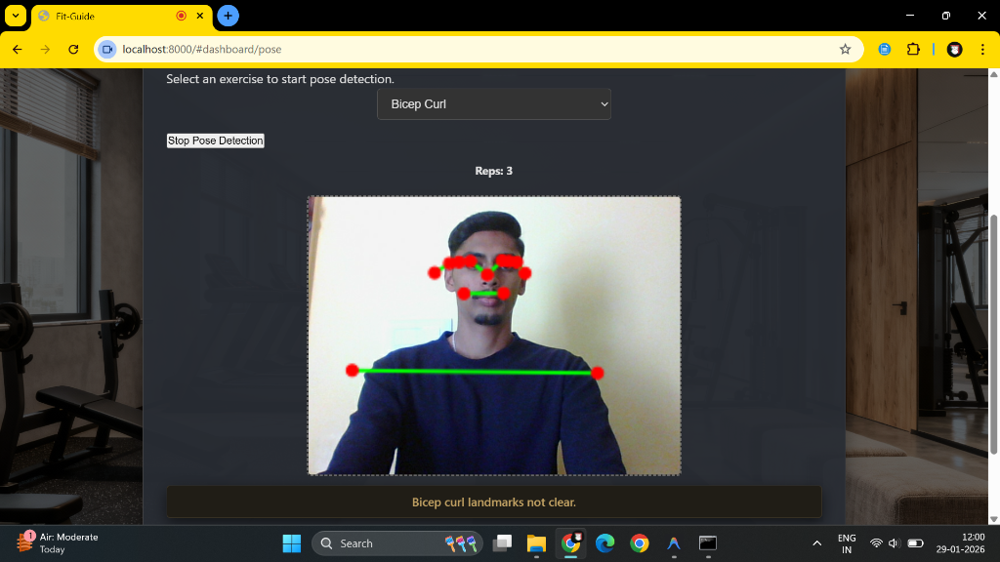
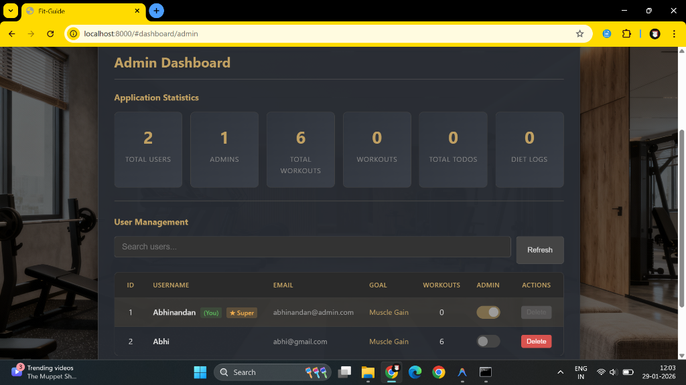

# 🧠 Fit-Guide: Personalized AI Fitness & Nutrition Coach

Fit-Guide is a high-performance, visually stunning AI-powered fitness and nutrition assistant. It leverages machine learning to provide personalized workout routines, 7-day diet plans, and real-time posture correction using computer vision.

## 🔗 Live Demo
Access the live version of the project here: [https://fitguide-frontend-g06v.onrender.com](https://fitguide-frontend-g06v.onrender.com)

---

## 📖 Table of Contents
1.  [📸 Project Gallery](#-project-gallery)
2.  [✨ Key Features](#-key-features)
3.  [🔐 Admin Credentials](#-admin-credentials)
4.  [🚀 How to Run the Project](#-how-to-run-the-project)
5.  [🛠️ Tech Stack](#-tech-stack)
6.  [🧠 Machine Learning Components](#-machine-learning-components)

---

## 📸 Project Gallery

### 🌐 User Dashboard

*Standard User View - Minimalist & Elegant*

### 🥗 Personalized Diet Plan

*AI-generated 7-day meal plans tailored to BMI and goals.*

### 🏋️ Workout Recommendations

*Targeted exercises based on user requirements.*

### 📷 Real-time Pose Detection

*Computer Vision feedback for exercise form.*

### ⚙️ Admin Dashboard

*Centralized management for users and system analytics.*

---

## ✨ Key Features

### 🛍️ User Experience (Frontend)
*   **AI Diet Engine:** Personalized 7-day meal plans (Breakfast, Lunch, Dinner) based on TDEE, BMI, and dietary preferences.
*   **Workout Coach:** Goal-oriented exercise suggestions with integrated timers.
*   **Computer Vision (Pose Detection):** Real-time feedback using MediaPipe for over 5 different exercises.
*   **Smart BMI Tracking:** Automatic calculation and categorization based on user profiles.
*   **Daily Task Manager:** Integrated To-Do list for fitness goal tracking.
*   **Google Calendar:** Seamless integration for workout reminders.

### 🔐 Administration (Backend)
*   **Centralized Analytics:** Track total users and workout logs in real-time.
*   **User Management:** Full administrative control over registered accounts.
*   **Secure Auth:** Robust session management and encrypted data storage.

---

## 🔐 Admin Credentials
To access the administrative features, use the following default credentials:

> [!IMPORTANT]
> **Email:** `abhinandan@admin.com`  
> **Password:** `123456`

---

## 🚀 How to Run the Project

### 🛠️ Prerequisites
*   Python 3.8+
*   pip (Python package installer)
*   Git
*   Modern Browser (Chrome/Firefox/Edge)

### 📦 Backend Setup
1.  **Create and activate a virtual environment:**
    ```bash
    python -m venv venv
    # Windows
    venv\Scripts\activate
    # macOS/Linux
    source venv/bin/activate
    ```
2.  **Install dependencies:**
    ```bash
    pip install -r requirements.txt
    ```
3.  **Run the Flask application:**
    ```bash
    python app.py
    ```
    *The server will start at `http://localhost:5000`. `app.db` is created automatically.*

### 🎨 Frontend Setup
1.  Navigate to the `frontend` directory:
    ```bash
    cd frontend
    ```
2.  **Serve the files:**
    ```bash
    python -m http.server 8000
    ```
3.  Open `http://localhost:8000` in your browser.

---

## 🛠️ Tech Stack

*   **Frontend:** HTML5, CSS3, ES6+ JavaScript, MediaPipe (Pose Detection)
*   **Backend:** Python 3, Flask, SQLAlchemy, Bcrypt, Flask-Login, Flask-CORS
*   **Machine Learning:** Scikit-learn, Pandas, OpenCV
*   **Database:** SQLite

---

## 🧠 Machine Learning Components

*   **Diet Recommendation:** Utilizes rule-based filtering and randomization on the `diet_dataset_1000.csv` to match target calories and preferences.
*   **Workout Logic:** Selecting specialized exercises based on BMI and fitness goals.
*   **Pose Detection:** Leveraging MediaPipe Pose for landmark detection and algorithmic posture assessment.

---

**Made with ❤️ for a better fitness experience**
