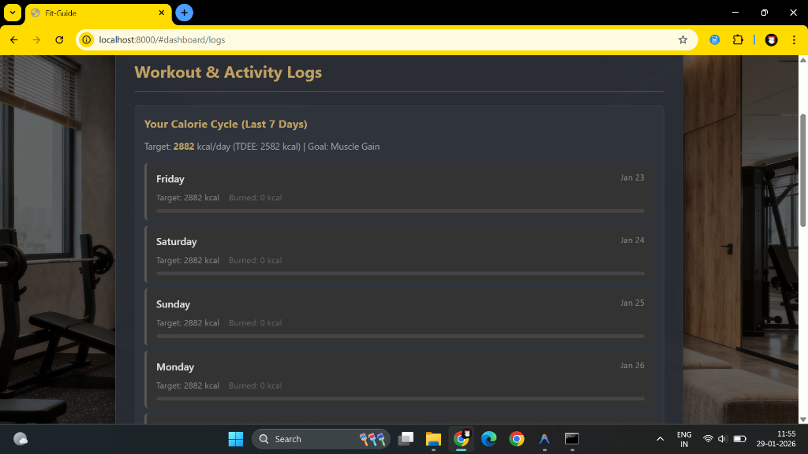

# Fit-Guide

## Project Title: Fit-Guide, An AI Personalized Fitness and Nutrition Coach Using Machine Learning.

**Live Demo:** [https://fitguide-frontend-g06v.onrender.com](https://fitguide-frontend-g06v.onrender.com)

---

## Table of Contents
1.  [Introduction](#introduction)
2.  [Features](#features)
3.  [Tech Stack](#tech-stack)
4.  [Project Structure](#project-structure)
5.  [Setup and Installation](#setup-and-installation)
    *   [Prerequisites](#prerequisites)
    *   [Backend Setup](#backend-setup)
    *   [Frontend Setup](#frontend-setup)
    *   [Creating an Admin User](#creating-an-admin-user)
6.  [Usage](#usage)
    *   [User Flow](#user-flow)
    *   [Admin Flow](#admin-flow)
7.  [Machine Learning Components](#machine-learning-components)

---

## Introduction

The Fit-Guide is a full-stack web application designed to provide users with tailored fitness routines, diet plans, and real-time pose correction. It leverages machine learning for personalized recommendations and aims to be an intelligent companion on a user's health and fitness journey. The application also includes an admin interface for user management and system oversight.

---

## Features

**User Features:**
*   **User Registration & Login:** Secure account creation and authentication.
*   **Profile Management:** Users can input and update personal details (age, gender, height, weight), diet preferences, activity levels, and fitness goals.
*   **BMI Calculation:** Automatic BMI calculation and categorization based on user profile.
*   **Personalized Weekly Diet Plan:**
    *   AI-generated 7-day meal plans (breakfast, lunch, dinner).
    *   Calorie-counted meals tailored to user's BMI, TDEE, and goals.
    *   Considers diet preferences (e.g., vegetarian, vegan) and preferred cuisines.
    *   Option to regenerate the weekly plan.
*   **Workout Recommendations:**
    *   Personalized workout suggestions (muscle gain, weight loss, endurance) based on user goals and BMI.
    *   Includes exercise name, type, target muscles, and duration/rep suggestions.
*   **Workout Timer:** Integrated timer for workout sessions.
*   **Real-time Pose Detection:**
    *   Utilizes webcam and MediaPipe for live posture analysis during exercises.
    *   Provides color-coded feedback (red for incorrect, green for correct posture).
*   **Workout Logging:** Users can log completed workouts (exercise, duration, estimated calories burned).
*   **Activity Logs View:** Display of past workout logs.
*   **To-Do List:** Integrated daily task manager for fitness-related goals.
*   **Google Calendar Integration (Optional):** Ability to set workout reminders in the user's Google Calendar.

**Admin Features:**
*   **Admin Login:** Secure login for administrators.
*   **Admin Dashboard:** Centralized view for system management.
*   **User Management:** View a list of all registered users and basic details. Option to delete users.
*   **System Analytics (Basic):** View total number of users, total workout logs.
*   *(Placeholder for future: Manage master diet/workout templates, view detailed system logs)*

---

## Screenshots

### User Dashboard


### Personalized Diet Plan


### Workout Recommendations


### Activity Logs


### Real-time Pose Detection


### Admin Dashboard


---

## Tech Stack

*   **Frontend:**
    *   HTML5
    *   CSS3 (with custom styling for a modern, responsive UI)
    *   JavaScript (ES6+)
    *   MediaPipe (for Pose Detection)
*   **Backend:**
    *   Python 3
    *   Flask (Web Framework)
    *   Flask-SQLAlchemy (ORM for database interaction)
    *   Flask-Login (User session management)
    *   Flask-Bcrypt (Password hashing)
    *   Flask-CORS (Cross-Origin Resource Sharing)
    *   SQLite (Database)
    *   Pandas (for data manipulation, e.g., diet dataset)
    *   Scikit-learn (Potentially for ML models if expanded beyond rule-based logic)
    *   OpenCV (Potentially for advanced image processing with MediaPipe)
    *   Google API Client Library for Python (for Google Calendar Integration)
*   **Database:**
    *   SQLite (for development and current version)
*   **Version Control:**
    *   Git & GitHub

---

## Project Structure


---

## Setup and Installation

### Prerequisites
*   Python 3.8+
*   pip (Python package installer)
*   Git
*   A modern web browser (Chrome, Firefox, Edge)
*   (Optional for Google Calendar) A Google Cloud Platform project with Google Calendar API enabled and `credentials.json` downloaded.

### Backend Setup

1.  **Create and activate a virtual environment:**
    ```bash
    python -m venv venv
    # Windows
    venv\Scripts\activate
    # macOS/Linux
    source venv/bin/activate
    ```

2.  **Install dependencies:**
    ```bash
    pip install -r requirements.txt
    ```

3.  **(Optional - Google Calendar)** Place your `credentials.json` file (downloaded from Google Cloud Console) into the `backend/` directory. Ensure it's listed in your `.gitignore` if you haven't already.

4.  **Run the Flask application:**
    ```bash
    python app.py
    ```
    The backend server should start, typically on `http://localhost:5000`. The database (`app.db`) and the default admin user will be created on the first run.
5.  **To check the model evaluation (metrics):**
    ```bash
    python run_evaluation.py
    ```
    This will evaluate the model and display the results in the terminal.

### Frontend Setup
1.  In a **new terminal window**, navigate to the `frontend` directory:
    ```bash
    cd path/to/your/Fit-Guide/frontend
    ```
2.  **Serve the frontend files using a simple HTTP server:**
    ```bash
    python -m http.server 8000
    ```
    (If `python` defaults to Python 2, use `python3 -m http.server 8000`)

3.  Open your web browser and go to `http://localhost:8000`.

### Creating an Admin User
The application attempts to create a default admin user on the first backend startup:
*   **Username:** `abhinandan@admin.com`
*   **Password:** `123456`

---

## Usage

### User Flow
1.  Navigate to `http://localhost:8000`. You will be presented with the **Login page**.
2.  If you are a new user, click "Register here".
3.  Fill out the registration form with your personal details, fitness goals, and preferences.
4.  After successful registration, you will be directed to the Login page.
5.  Log in with your credentials.
6.  Upon successful login, you will be redirected to your personalized **User Dashboard**.
7.  From the dashboard, you can:
    *   View your profile summary.
    *   Access your 7-day personalized diet plan (navigate by day).
    *   Get workout recommendations and use the timer.
    *   Use the real-time pose detection feature for selected exercises.
    *   View your past workout logs.
    *   Manage your daily to-do list.
    *   (If configured) Connect to Google Calendar and set reminders.
8.  Click "Logout" in the header to end your session.

### Admin Flow
1.  Navigate to `http://localhost:8000`.
2.  Log in using the admin credentials (Username: `abhinandan@admin.com`, Password: `123456`).
3.  Upon successful login, you will be redirected to the **Admin Dashboard**.
4.  From the admin dashboard, you can:
    *   View system summary data (e.g., total users).
    *   List all users.
    *   Delete non-admin users.
    *   *(Future: Access other admin functionalities as they are built).*
5.  Click "Logout" in the header to end your admin session.

---

## Machine Learning Components

*   **Diet Recommendation:** Currently uses a rule-based filtering and randomization approach on the `diet_dataset_1000.csv` to generate meal plans based on user's target calories, diet preferences, and cuisine choices. *(Future: Could be enhanced with a collaborative filtering or content-based model if user rating data or more detailed food item features become available).*
*   **Workout Recommendation:** Primarily logic-based, selecting exercises from a predefined list based on user goals and BMI category. *(Future: Could use the `fitness_dataset_1000.csv` to learn patterns or use clustering to find similar users for recommendations).*
*   **Pose Detection:** Utilizes Google's MediaPipe Pose model for real-time landmark detection. Feedback logic is currently rule-based (angles, relative positions). *(Future: A custom CNN could be trained on pose landmarks or video frames for more nuanced and exercise-specific posture correction, but this is a significant undertaking).*
